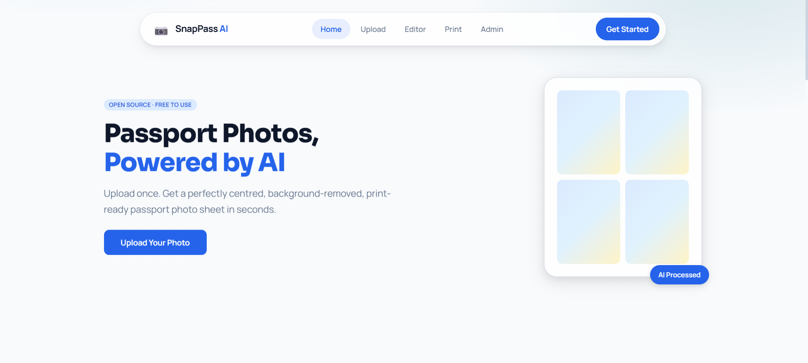
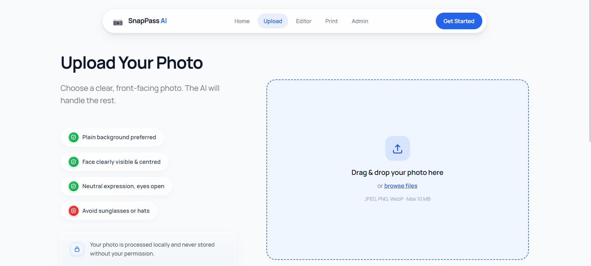
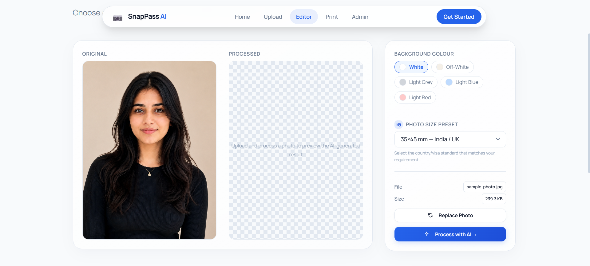
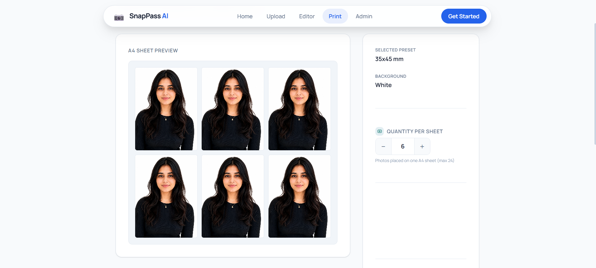

<div align="center">

<h1>📷 SnapPass AI</h1>

<p><strong>Open-source AI-powered passport photo studio</strong><br/>
Upload → Auto-process → Generate a print-ready sheet — in seconds.</p>

[](LICENSE)
[](CONTRIBUTING.md)
[](https://github.com/souma9830/SnapPass-AI)
[](https://reactjs.org)
[](https://nodejs.org)
[](https://python.org)

</div>

---

## 📚 Table of Contents

- [📌 What is SnapPass AI?](#-what-is-snappass-ai)
- [✨ What It Does](#-what-it-does)
- [📸 Website Preview](#-website-preview)
- [🧭 Project Status](#-project-status)
- [🖥️ Tech Stack](#️%EF%B8%8F-tech-stack)
- [📁 Folder Structure](#-folder-structure)
- [🚀 Getting Started](#-getting-started)
- [🐳 Docker (Compose)](#-docker-compose)
- [🗺️ App Flow (UI)](#️%EF%B8%8F-app-flow-ui)
- [📡 API Endpoints](#-api-endpoints)
- [🌍 Supported Passport Photo Sizes](#-supported-passport-photo-sizes)
- [🔧 Environment Variables](#-environment-variables)
- [🛣️ Roadmap](#️%EF%B8%8F-roadmap)
- [🤝 Contributing](#-contributing)
- [🏷️ Good First Issues](#️%EF%B8%8F-good-first-issues)
- [📜 License](#-license)
- [👨‍💻 Project Admin](#%E2%80%8D-project-admin)

---

## 📌 What is SnapPass AI?

**SnapPass AI** is a free, open-source web application that lets anyone generate professional passport-quality photos from any selfie or portrait.

No expensive studio. No complicated software. Just upload, click, and print.

### ✨ What it does

| Step | Description |
|------|-------------|
| 📤 **Upload** | Drag & drop or browse any portrait photo |
| 🧠 **AI Process** | Background removal, face centering, DPI optimisation |
| 📐 **Customise** | Choose country standard (India, USA, UK, Schengen…) |
| 🖨️ **Print** | Download a print-ready A4 sheet with multiple photos |

---

## 📸 Website Preview

<div align="center">

### 🏠 Home Page


<br/><br/>

### 📤 Upload Interface


<br/><br/>

### ✂️ Editor / Passport Processing


<br/><br/>

### 📄 Print Preview


<br/><br/>

</div>


---

## 🧭 Project Status

> ⚠️ **This project is in active early development.** The frontend scaffold is complete and functional. The backend and Python AI service stubs are ready for contributors to build on.

| Layer | Status |
|-------|--------|
| Frontend (React) | ✅ Scaffold complete — fully navigable |
| Backend (Express) | 🟡 Scaffold ready — needs controller logic |
| Python AI Service | 🟡 Structure ready — needs OpenCV / rembg logic |
| Database (MongoDB) | 🔲 Structure planned — not yet implemented |

---

## 🖥️ Tech Stack

| Layer | Technology |
|-------|-----------|
| **Frontend** | React.js, React Router DOM, Vanilla CSS |
| **Backend** | Node.js, Express.js, Multer |
| **AI Microservice** | Python, Flask, OpenCV, Pillow, rembg |
| **Database** *(planned)* | MongoDB |

---

## 📁 Folder Structure

```
snappass-ai/
│
├── frontend/                          # React frontend application
│   ├── src/
│   │   ├── components/
│   │   │   ├── layout/               # Shared layout components
│   │   │   │   ├── Navbar.jsx
│   │   │   │   └── Footer.jsx
│   │   │   ├── UploadBox.jsx         # Drag-and-drop uploader
│   │   │   ├── PhotoPreview.jsx      # Image preview component
│   │   │   ├── LoadingSpinner.jsx    # Reusable loading UI
│   │   │   └── ...
│   │   │
│   │   ├── pages/                    # Application pages
│   │   │   ├── HomePage.jsx
│   │   │   ├── UploadPage.jsx
│   │   │   ├── EditorPage.jsx
│   │   │   ├── PrintPreviewPage.jsx
│   │   │   └── AdminDashboard.jsx
│   │   │
│   │   ├── hooks/                    # Custom React hooks
│   │   │   ├── usePhotoUpload.jsx
│   │   │   └── useImageProcessor.jsx
│   │   │
│   │   ├── services/                 # API communication layer
│   │   │   ├── api.jsx
│   │   │   └── photoService.jsx
│   │   │
│   │   ├── utils/                    # Utility/helper functions
│   │   │   ├── fileValidation.jsx
│   │   │   └── formatters.jsx
│   │   │
│   │   └── routes/                   # App routing configuration
│   │       └── AppRoutes.jsx
│   │
│   ├── Dockerfile
│   ├── package.json
│   └── README.md
│
├── backend/                           # Express.js backend API
│   ├── src/
│   │   ├── config/                   # Environment & DB configs
│   │   │   ├── config.js
│   │   │   └── db.js
│   │   │
│   │   ├── controllers/              # Route controllers
│   │   │   ├── auth.controller.js
│   │   │   ├── upload.controller.js
│   │   │   ├── image.controller.js
│   │   │   └── print.controller.js
│   │   │
│   │   ├── routes/                   # Express route definitions
│   │   │   ├── auth.routes.js
│   │   │   ├── upload.routes.js
│   │   │   ├── image.routes.js
│   │   │   └── print.routes.js
│   │   │
│   │   ├── middleware/               # Express middlewares
│   │   │   ├── auth.middleware.js
│   │   │   ├── upload.middleware.js
│   │   │   ├── validate.middleware.js
│   │   │   └── error.middleware.js
│   │   │
│   │   ├── models/                   # MongoDB/Mongoose models
│   │   │   ├── user.model.js
│   │   │   ├── upload.model.js
│   │   │   ├── processedImage.model.js
│   │   │   └── printSheet.model.js
│   │   │
│   │   ├── dao/                      # Database access layer
│   │   ├── service/                  # Business logic/services
│   │   ├── validation/               # Request validation rules
│   │   └── utils/                    # Shared backend utilities
│   │       └── errors/
│   │
│   ├── docs/                         # Backend documentation
│   ├── server.js
│   ├── Dockerfile
│   └── package.json
└── python-ai-service/          # Python Flask AI microservice
|   ├── app/
|   │   └── services/
|   │       ├── bg_remove.py           # rembg background removal
|   │       ├── face_center.py         # OpenCV face detection
|   │       ├── dpi_optimizer.py       # DPI resize logic
|   │       └── sheet_generator.py     # A4 sheet layout
|   └── requirements.txt
│
├── docker-compose.yml
├── CONTRIBUTING.md
├── SECURITY.md
└── README.md

```

## 🚀 Getting Started

### Prerequisites

Make sure you have these installed:

- [Node.js](https://nodejs.org/) v18 or higher
- [Python](https://python.org/) 3.9 or higher
- [Git](https://git-scm.com/)

---

### 1. Clone the Repository

```bash
git clone https://github.com/souma9830/SnapPass-AI.git
cd SnapPass-AI
```

---

### 2. Run the Frontend

```bash
cd frontend
npm install
npm start
```

Open [http://localhost:3000](http://localhost:3000) in your browser.

---

### 3. Run the Backend

```bash
cd backend
npm install
npm run dev
```

Backend runs at [http://localhost:3000](http://localhost:3000).

Health check: `GET http://localhost:3000/health`

---

### 4. Run the Python AI Service *(optional — not fully implemented yet)*

```bash
cd python-ai-service
pip install -r requirements.txt
python main.py
```

AI service runs at [http://localhost:8000](http://localhost:8000).

---

## 🐳 Docker (Compose)

Run all services (frontend, backend, python-ai-service, MongoDB) with one command:

Note: the Docker setup is intended for local development and testing; production is handled via Vercel.

```bash
docker compose up --build
```

Default ports:
- Frontend: http://localhost:5173
- Backend: http://localhost:5000
- Python AI: http://localhost:8000
- MongoDB: mongodb://localhost:27017

Note: the python-ai-service container expects a `main.py` entrypoint in `python-ai-service/`.

---

## 🗺️ App Flow (UI)

```
Home
  └── /upload         (Upload your photo)
        └── /editor   (Choose background + size → AI process)
              └── /print-preview  (Set quantity → Download A4 sheet)
```

---

## 📡 API Endpoints

| Method | Endpoint | Description |
|--------|----------|-------------|
| `POST` | `/api/upload` | Upload photo |
| `GET`  | `/api/upload/:id` | Get upload metadata |
| `POST` | `/api/process` | AI process photo |
| `GET`  | `/api/process/preview/:filename` | Get processed preview |
| `POST` | `/api/print/generate-sheet` | Generate A4 print sheet |
| `GET`  | `/api/print/presets` | List size presets |
| `GET`  | `/health` | Backend health check |

---

## 🌍 Supported Passport Photo Sizes

| Preset ID | Standard | Dimensions |
|-----------|----------|------------|
| `35x45` | India / UK Passport | 35 × 45 mm |
| `51x51` | USA Visa | 51 × 51 mm |
| `33x48` | Schengen Visa | 33 × 48 mm |
| `40x60` | China Visa | 40 × 60 mm |
| `2x2in` | US Passport | 2 × 2 inches |

---

## 🔧 Environment Variables

### Frontend (`frontend/.env`)

```env
VITE_API_URL=http://localhost:3000/api
```

### Backend (`backend/.env`)

```env
PORT=3000
NODE_ENV=development
AI_SERVICE_URL=http://localhost:8000
UPLOAD_DIR=uploads
MAX_FILE_SIZE=10485760
CORS_ORIGIN=http://localhost:3000
MONGO_URI=mongodb://localhost:27017/snappass
```

---

## 🛣️ Roadmap

### Phase 1 — Foundation ✅
- [x] React frontend scaffold with all pages & components
- [x] Express backend scaffold with all routes & controllers
- [x] Python AI service structure

### Phase 2 — Core Features 🚧 *(contributors needed!)*
- [ ] Background removal using `rembg`
- [ ] Face detection & auto-centering using OpenCV
- [ ] DPI optimisation & resize to standard dimensions
- [ ] A4 print sheet generation using Pillow

### Phase 3 — Enhancements 🔲
- [ ] MongoDB database integration
- [ ] User session & upload history
- [ ] Real-time image preview after AI processing
- [ ] Admin dashboard with live statistics
- [ ] Multi-file batch upload support

### Phase 4 — Production 🔲
- [ ] Docker Compose setup
- [ ] CI/CD pipeline
- [ ] Deploy guide (Vercel + Render + Railway)
- [ ] PWA support
- [ ] Dark mode

---

## 🤝 Contributing

We ❤️ contributions! Whether you're fixing bugs, building features, improving docs, or designing UI elements — every contribution matters.

👉 **Read the full guide:** [CONTRIBUTING.md](CONTRIBUTING.md)

**Quick summary:**

1. Fork the repo
2. Create a branch: `git checkout -b feature/your-feature-name`
3. Make your changes
4. Open a Pull Request to `master`

---

## 🏷️ Good First Issues

New to open source? Look for issues tagged:

- `good first issue` — small, well-defined tasks
- `help wanted` — features awaiting a contributor
- `documentation` — improve docs and comments

---

## 📜 License

This project is licensed under the **MIT License** — see [LICENSE](LICENSE) for details.

You are free to use, modify, and distribute this project for both personal and commercial use.

---

## 👨‍💻 Project Admin

**Soumadeep** — [@souma9830](https://github.com/souma9830)

---

<div align="center">

**⭐ If you find this useful, please star the repository — it helps others discover the project!**

[⭐ Star on GitHub](https://github.com/souma9830/SnapPass-AI) · [🐞 Report a Bug](https://github.com/souma9830/SnapPass-AI/issues/new?template=bug_report.md) · [💡 Request a Feature](https://github.com/souma9830/SnapPass-AI/issues/new?template=feature_request.md)

</div>
